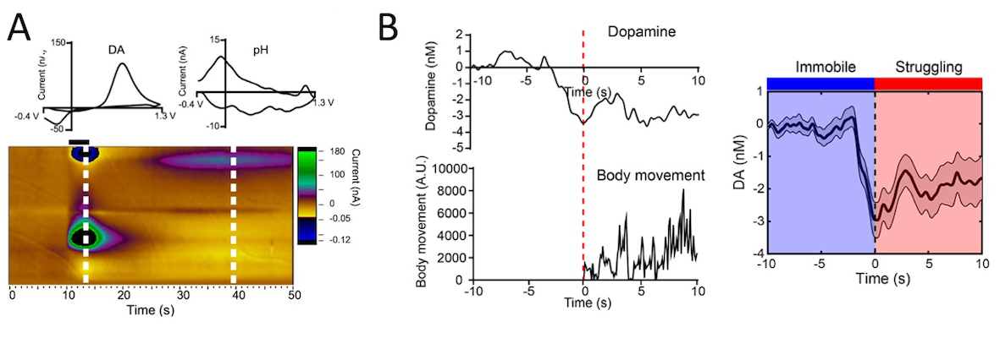
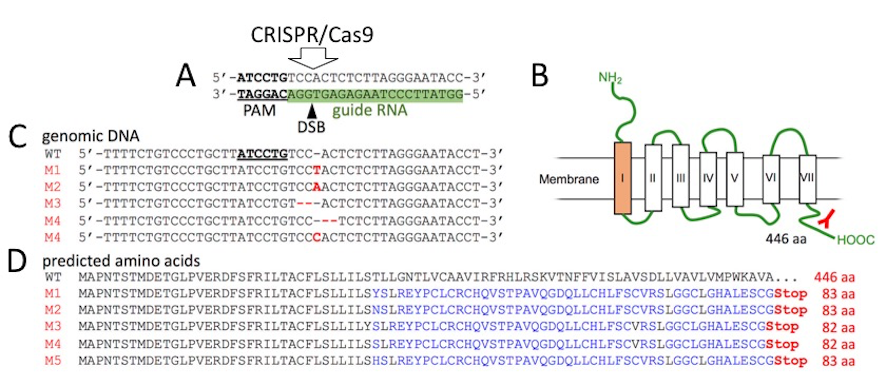

We recently published a paper on a role of neurotransmitter dopamine in stress-coping behavior in Journal of Neuroscience. 

[Our publication in the Journal of Neurosience](https://www.jneurosci.org/content/early/2020/08/26/JNEUROSCI.0444-20.2020)

When the animals encounter the environmental threat as stressor, we can think of two distinct strategies to cope with it. One is to try to overcome it by exploring actively and be against it, the other is to avoid and refrain from being close to it passively. Active and passive coping of the stress would be the basis to determine the behavioral strategies upon exposure to the stressor. Since maladaptation to the stress predispose the psychiatric disorders such as depression and anxiety, understanding the molecular mechanism underlying it is indispensable for the development of therapeutic intervention for them. 

To address this, we focused on neurotransmitter dopamine which plays pivotal roles in decision making and reinforcement of the behaviors. We developed a fine carbon fiber electrode to scan the brain region called nucleus accumbens to examine how the dopamine release change when the mice changed stress-coping behaviors under the inescapable stress such as tail suspension. We found that reduction of dopamine release in this area precede the initation of escape behavior, implicating the dopaminergic transmission to the decision making under the stress. 

To check the causal effect of reduced dopamine release on mouse behaviors, we took two indepdent strategies. Optogenetic inhibitoin of dopaminergic fibers in the nucleus accumbens allowed inhibition of dopamine release at any time you want thru illumination of blue light. 

Another tool we used this time is CRISPR/Cas9 which deletes the receptors for dopaminergic transmission efficiently in the mouse brain by way of viral vector. 

Both experiments proved that impaired dopaminergic transmission caused induction of escape behavior during tail suspension stress. Through this study, we are pleased to establish three important tools which must be useful for futre study: fast scanning cyclic voltammetry, optogenetics and CRISPR/Cas9. 

I hope to discuss these new tools in the post comming soon.

#Neurobiology #Hiroshima #Brain #神経 #広島 #脳