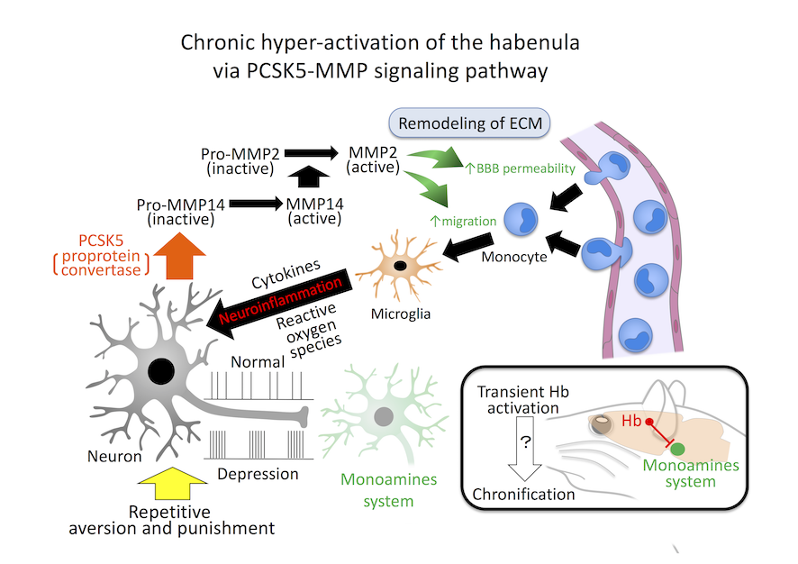

We have just published a paper which identified a novel gene Pcsk5 acting on immune reaction in the mouse brain. Chronic stress activated this gene, which led to the subsequent activation of the other genes MMPs causing remodeling of the extracellular matrix. Since immune cell such as monocyte and microglia started to be activated and move more actively upon remodeling of extracellular matrix, Neurons seems to produce Pcsk5 seems to induce neuroinflammation in response to the chronic stress.

[Our publication in the Neuropsychopharmacology](https://www.nature.com/articles/s41386-020-00843-0)

[Press release from Hiroshima University](https://www.hiroshima-u.ac.jp/system/files/149927/20200916_pr01.pdf)

[Press release from AMED](https://www.amed.go.jp/news/release_20200917-01.html)

Interestingly, this protein turned out to be localize to the small area in the brain called habenula. This region attracts a surge of interest according to its role in regulation of central monoaminergic system. Monoamines such as dopamine and serotonin are known to be a basis of pathophysiology of depression and paharmacological action of antidepressant available currently. Since this area is excited when the animal perceives disappointment and punishment, it is proposed that the habenula may act as a negative source of reinforcement signal in the brain to control our behavioral strategy for survival. 

Taking the current results into consideration, we may begin to understand how the transient activation of the habenula via punishment or disappointment can be chronic via changes in extracellular environment. 

#Neurobiology #Hiroshima #Brain #神経 #広島 #脳