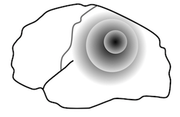

# Development of the animal model for depression
The habenula is a diencephalic nucleus regulating monoamines such as dopamine and serotonin. We recently found that pathological activation of the habenula led the mice to show depressive-like behaviors under acute and chronic stress. Analyses revealed that mice with hyperactivated habenula showed reduction in the number of c-Fos positive cells in the brain stem nuclei producing the serotonin and dopamine, indicating that activation of those monoaminergic neurons was reduced upon activation of the habenula. Thus, our working hypothesis is that habenular activation elicits depressive-like behaviors by way of modulating monoaminergic activities.

See link below for details.

[Project: Role of habenula in depression](https://neurobio.hiroshima-u.ac.jp/en/project/habenula-project/)

# Killer wave in the damaged brain: spreading depression
Excitatory neural transmission is primarily mediated by glutamate in the synapse. However, excess extracellular glutamate is rather harmful for the brain and sometimes worsens brain pathology in neurological disorders such as stroke and migraine. Such pathological activation of neural tissue some can be propagated like waves in the brain and affect the prognosis of those diseases.

The ischemic and hypoglycemic brain, in particular, has an increase in neural excitability and shows propagation of neuronal and glial depolarization, a phenomenon known as spreading depolarization (spreading depression). Lesion core with hypoxia, for example, releases excitatory molecules such as glutamate and potassium. These molecules diffuse outside the cells and, in turn, activate the neurons surrounding the lesion core. Propagation of such an excitatory wave results in further demand of energy essential to maintain the viability of the tissue at risk surround the lesion core.

Indeed, recent studies frequently reported that spreading depolarization occured in the cerebral cortex of the patients with stroke and migraine. To make matters worse, a report revealed that the prognosis in the patients with traumatic brain injury was negatively correlated with the number of spreading depolarization observed in a given period.

Thus, therapeutic intervention to suppress spreading depolarization will be in need to improve sequelae in stroke. To address this, Professor Kohichi Tanaka (Tokyo Medical and Dental University) and I focused on a role of the glial cells in the brain. Glial cells such as astrocytes act to determine levels of glutamate concentration outside cells. Since astrocytes regulate the extracellular glutamate level by the glutamate transporter which uptakes the extracellular glutamate, we hypothesize that glutamate transporter activity in the astrocytes determines a susceptibility of the brain to spreading depression. Recent analyses revealed that mutant mice lacking glutamate transporter GLT-1 in a subset of astrocytes in the cerebral cortex had increased sensitivity to spreading depression with altered kinetics in extracellular glutamate.

See link below  for details.

[Spreading depression implicated in migraine and stroke](https://neurobio.hiroshima-u.ac.jp/en/post/20200626/)

# How do we save the brain from critical illness?

Sepsis is a life-threatening dysfunction of multiple organs caused by a dysregulated host response to infection. Notably, sepsis-associated encephalopathy (SAE) is a diffuse brain dysfunction associated with sepsis. As SAE develops a wide variety of disorders in neural functions, ranging from delirium to long-term cognitive impairment, molecular mechanism underlying it remains elusive.

Convergent lines of evidence recently supported that physical and emotional stress induced inflammatory responses in the central nervous system. Microglia play a pivotal role in induction and expansion of the neuroinflammatory reactions. Activated microglia are known to secrete the signaling molecules such as reactive oxygen species (ROS) and cytokines, which mediates the interplay between neurons and glia. 

We begin to understand a role of microglia in SAE by examining the function of mitochondrial protein, translocator protein 18 kDa (TSPO). As it is upregulated in immune cells such as microglia, it has attracted a surge of interest as a biomarker of the inflammatory response in the CNS. Indeed, microglial activity seems to be under the regulation of TSPO, at least in part.

By extending those studies, we hope to develop a novel category of drugs for the treatment of SAE and stressor-related disorder which might occurs in intensive care survivors.

See below for details.

[Project: Neurobiology of the brain with critical illness](https://neurobio.hiroshima-u.ac.jp/en/project/sepsis-project/)

Kikutani K, Giga H, Hosokawa K, Shime N, Aizawa H, __Microglial translocator protein and stressor-related disorder.__ Neurochem Int. 2020, _in press_ [[Link]](https://doi.org/10.1016/j.neuint.2020.104855)