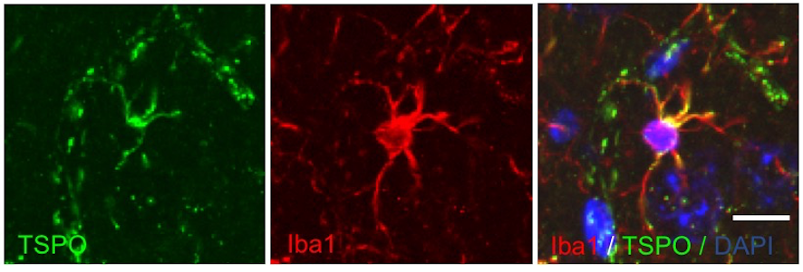

Sepsis is a life-threatening dysfunction of multiple organs caused by a dysregulated host response to infection. Notably, sepsis-associated encephalopathy (SAE) is a diffuse brain dysfunction associated with sepsis. As SAE develops a wide variety of disorders in neural functions, ranging from delirium to long-term cognitive impairment, molecular mechanism underlying it remains elusive.

Convergent lines of evidence recently supported that physical and emotional stress induced inflammatory responses in the central nervous system. Microglia play a pivotal role in induction and expansion of the neuroinflammatory reactions. Activated microglia are known to secrete the signaling molecules such as reactive oxygen species (ROS) and cytokines, which mediates the interplay between neurons and glia. 

We begin to understand a role of microglia in SAE by examining the function of mitochondrial protein, translocator protein 18 kDa (TSPO). As it is upregulated in immune cells such as microglia, it has attracted a surge of interest as a biomarker of the inflammatory response in the CNS. Indeed, microglial activity seems to be under the regulation of TSPO, at least in part.

By extending those studies, we hope to develop a novel category of drugs for the treatment of SAE and stressor-related disorder which might occurs in intensive care survivors.

See below for details.

Kikutani K, Giga H, Hosokawa K, Shime N, Aizawa H, __Microglial translocator protein and stressor-related disorder.__ Neurochem Int. 2020, _in press_ [[Link]](https://doi.org/10.1016/j.neuint.2020.104855)

Nozaki K, Ito H, Ohgidani M, Yamawaki Y, Sahin EH, Kitajima T, Katsumata S, Yamawaki S, Kato TA, Aizawa H. __Antidepressant effect of the translocator protein antagonist ONO-2952 on mouse behaviors under chronic social defeat stress.__  Neuropharmacology. 2020 Jan 1;162:107835.[[Link]](10.1016/j.neuropharm.2019.107835) 

