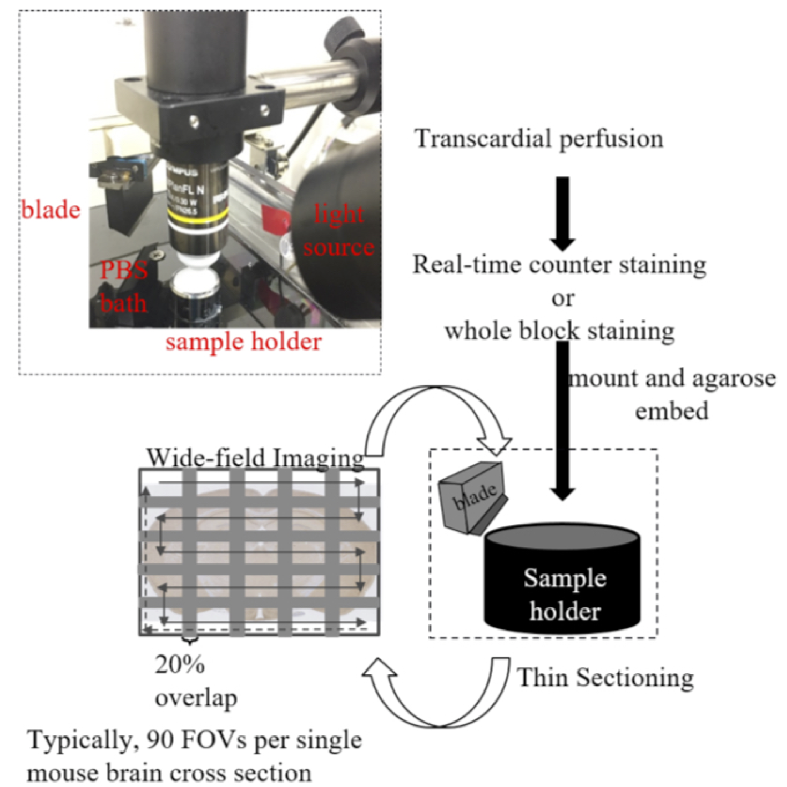
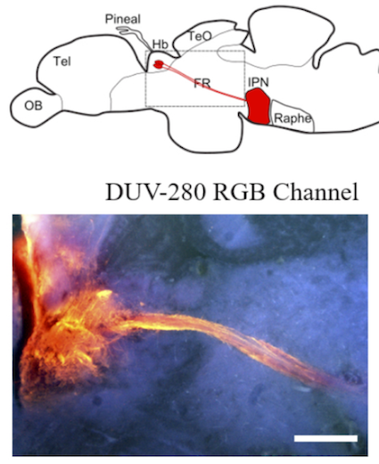

Deciphering the connectivity between brain regions is critical in understanding how the brain works. Three dimensional visualization of such networks of the neurons has been hampered by poor penetration of visible light into the large brain tissue. 

To address this, our group combined the serial sectioning of the tissue block to expose new surface of the brain with scanning by light. Collected image would be used for three dimensional reconstruction of the brain structure later in the offiline analysis. 

[Deep ultraviolet light based wide-field fluorescence microscope for brain imaging, preprint available in bioRxiv (doi: https://doi.org/10.1101/2020.10.27.342345)](https://www.biorxiv.org/content/10.1101/2020.10.27.342345v1)

Since visible light excites the fluorescent label out of focus, which makes the image blurred, we applied light to a limited optical plane at the surface of the exposed tissue block. Deep ultraviolet (DUV) light loses its power quickly after it reaches at the plane within 10-20 µm from the surface so that the image consists of the emitted light coming from the plane in focus. 

This is combined with motorized optics which enables scanning wide field of view to image the large brain tissue for three dimensional reconstruction. 

We applied this technique to the brain samples of small animals expressing green fluorescent protein and lipophilic dye in the neural pathways of mice and zebrafish. We are currently screening the fluorescent proteins and dyes compatible with this technology to widen the area for further application. 

Interestingly, DUV imaging is quite cost-effective according to the simplicity of the optical setup. This is advantageous for the high throughput analyses with multple setups in the lab over the pre-existing expensive solution such as light-sheet and two-photon microscopies. 

#Neurobiology #Hiroshima #Brain #神経 #広島 #脳