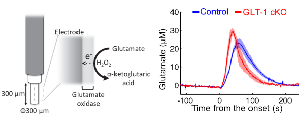

Our group published a paper in the journal GLIA on a role of glutamate in spreading depression, a pre-clinical model for the aura preceding the migraine. 

[Our publication in GLIA](https://onlinelibrary.wiley.com/doi/10.1002/glia.23874)

[Press release from the Hiroshima University](https://www.hiroshima-u.ac.jp/news/58665)

Spreading depression is a propagating wave of neuronal and glial excitation under the pathological conditions. Studies suggested that it is found in the neurological disorders such as migraine and ischemic stroke. In particular, one third of migrainers are known to show neurological deficits (e.g., visual defect) in advance of the headache. Despite its clinical significance, molecular mechanism underlying the spreading depression reamins elusive. 

Glutamate, an amino acid, acts as neurotransmitter in the brain. Upon binding of glutamate to the receptors, it modulates the flow of channel across the cell membrane of neurons to let it excited. This is how the glutamte facilitates the communication between neurons connecting with axonal fiber. If it acts too much with excessively high level in concentration in the extracellular space, it could be pathological and lead to the disorganized neural network activity and cell death.

We hypothesize that glutamate metabolism underlies the spreading depression. To address this, we examined the multiple knockout mice lacking any of the glutamate transporters, key modulators of the extracellular concentration of glutamate. Electrophysiological analｓysis revealed that mice lacking one of the glutamate transporters GLT-1 exhibited highest susceptibility to the spreading depression among mutant mice. 

To address a role of GLT-1 in glutamate metabolism, we developed glutamate biosensor which measure the glutamate concentration 4 times in a second. Mice lacking GLT-1 exhibited accumulation of extracellular glutamate more quickly than control, suggesting that GLT-1 plays a critical role in clearing glutamate from the extracellular space to maintain the ambient condition there.

Collectively, these results indicate a drug enhancing GLT-1 function might be a candidate to treat the migrain by reducing the susceptibility to spreading depression. We hope to screen such drug using model animals soon.

#Neurobiology #Hiroshima #Brain #神経 #広島 #脳