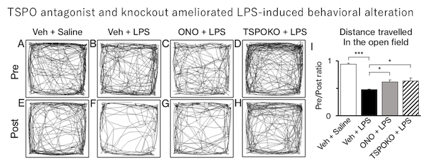

Stressors such as surgery, infection and injury lead to the pathological condition known as sepsis. Associate with the systemic inflammation, not only the visceral organs but the brain starts to respond and behave in an unusual way. Sepsis-associated encephalopathy (SAE) is a diffuse brain dysfunction associated with sepsis. The development of an effective strategy for early diagnosis and therapeutic intervention is essential for the prevention of poor prognosis of SAE. 

Translocator protein 18 kDa (TSPO) is a mitochondrial protein implicated in inflammatory responses. Despite accumulating evidence that implicates TSPO in the neuroinflammatory response of the central nervous system, the possible role of TSPO in SAE remains unclear. In the current study, we addressed a role of TSPO in neuroinflammation using mice 24 h after systemic injection of lipopolysaccharide (LPS), which consistently demonstrated microglial activation and behavioral inhibition. 

Hiroshi Giga, Bin Ji, Kazuya Kikutani, Shuji Fukuda, Takashi Kitajima, Seishi Katsumata, Miho Matsumata, Tetsuya Suhara, Shigeto Yamawaki, Nobuaki Shime, Koji Hosokawa, Hidenori Aizawa __"Pharmacological and Genetic Inhibition of Translocator Protein 18 kDa Ameliorated Neuroinflammation in Murine Endotoxemia Model"__ SHOCK (2020) _in press_
[[Link]](http://10.1097/SHK.0000000000001703)

Gene expression analysis showed that TSPO in the hippomcapus was induced following the systemic LPS injection, associated with an increase in pro-inflammatory cytokines such as tumor necrosis factor-a and interleukin-1b. Interestingly, pretreatment with the TSPO antagonist, ONO-2952, or germ-line deletion of the TSPO gene exhibited an anti-inflammatory effect with significant suppression of LPS-induced production of those cytokines. 

These effects of ONO-2952 or TSPO knockout were associated with significant recovery from behavioral inhibition, as shown by improved locomotor activity in the open field analysis. We also observed that ONO-2952 pretreatment suppressed the LPS-induced activation of TSPO-expressing microglia in the hippocampus. 

This is how we began to understand a critical role of TSPO in SAE. Based on this finding, monitoring TSPO activity, as well as the progress of sepsis and its sequelae in the animal model, would deepen our understanding of the underlying molecular mechanism of SAE.

#Neurobiology #Hiroshima #Brain #神経 #広島 #脳