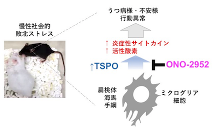

## 多彩な文化的背景をもつメンバーと脳の不思議を議論
スーパーグローバル大学として国際化を加速する広島大学は「世界をキャンパスとして展開する広島大学改革」を進めています。外国人教員や女性教員の増員を基盤に、世界各国から広く大学生・大学院生を受け入れており、多彩な文化背景をもつ研究者や学生が教育・研究を展開しています。

私達は外国人教員（これまでに３名）と外国人学生（これまでに５名）とともに英語での議論を日々重ね、週１回のProgress report / Journal clubを通して脳科学を学んでいます。

## 国際共同研究と産学連携
また、国内外からの共同研究を受け入れ、実際に共同実験を広島でおこなったり、製薬企業との共同研究も積極的に行っています。

実際、最近小野薬品工業との国際共同研究を進め、慢性ストレスに対する抗ストレス効果をもつ化合物を見出し、プレス発表や論文発表を通して広く社会へ発信しています。

広島大学プレスリリース：[脳の炎症に作用する TSPO を標的とした新たな抗うつ薬候補を発見](https://www.hiroshima-u.ac.jp/system/files/129948/%E3%83%97%E3%83%AC%E3%82%B9%E3%83%AA%E3%83%AA%E3%83%BC%E3%82%B9%EF%BC%88%E8%84%B3%E3%81%AE%E7%82%8E%E7%97%87%E3%81%AB%E4%BD%9C%E7%94%A8%E3%81%99%E3%82%8BTSPO%E3%82%92%E6%A8%99%E7%9A%84%E3%81%A8%E3%81%97%E3%81%9F%E6%96%B0%E3%81%9F%E3%81%AA%E6%8A%97%E3%81%86%E3%81%A4%E8%96%AC%E5%80%99%E8%A3%9C%E3%82%92%E7%99%BA%E8%A6%8B%EF%BC%89.pdf)

Nozaki K, Ito H, Ohgidani M, et al. Antidepressant effect of the translocator protein antagonist ONO-2952 on mouse behaviors under chronic social defeat stress. Neuropharmacology. 2020;162:107835. [[Link]](doi:10.1016/j.neuropharm.2019.107835)

