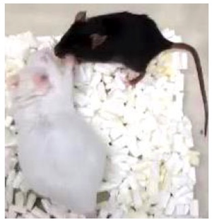
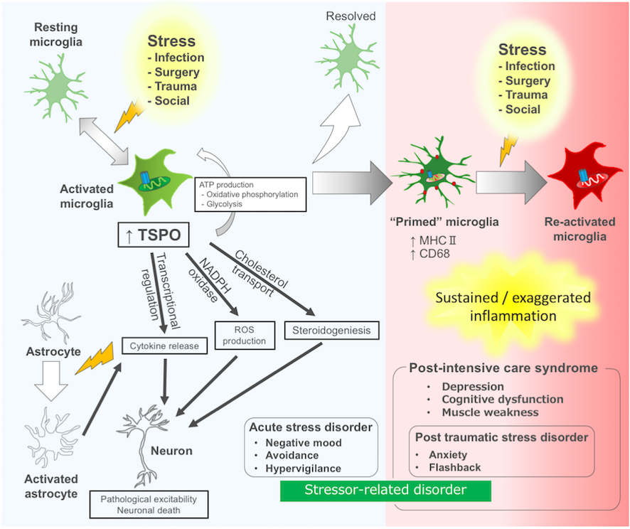

# うつ病の理解へむけたモデル動物と手綱核神経回路
手綱核は脳のほぼ中心部にある小さな領域ですが、精神・神経疾患の病態に深く関与するドーパミンやセロトニンなどの神経伝達物質の代謝を上位から制御する領域として、近年大きな注目を集めています。私達はうつ病における手綱核の役割を調べるため、手綱核の過剰活性化したマウスを遺伝子改変により作成し、ストレス環境下におけるうつ病様異常を調べています。これまでにこのマウスの脳幹部ではドーパミンやセロトニン産生細胞の活性化が抑えられており、ストレス感受性が高まっていることを見出しています。

研究プロジェクト：[うつ病における手綱核の役割](https://neurobio.hiroshima-u.ac.jp/ja/project/habenula-project/)

また、最近ではこのような手綱核の活性化に嫌な出来事や失望体験がどのように関わるかを調べています。特に神経細胞の働きを左右する細胞外環境を形成するグリア細胞の役割に注目しています。実際、慢性ストレスによりうつ病のような行動を示すマウスの手綱核を調べたところ、サイトカインと呼ばれる液性因子が多く産生されていて、炎症性細胞が多く動員されていました。その分子的背景を調べると、Pcsk5という細胞外基質の再編成に関与する遺伝子の発現が増えていました。この遺伝子の働きを抑えるとうつ病のような行動が起きにくくなることも明らかとなり、ストレスが動物行動を制御する手がかりをつかみつつあります。

最近のニュース：[脳の神経炎症がうつ病のような行動に関与](https://neurobio.hiroshima-u.ac.jp/en/post/20200918)

広島大学プレスリリース：[脳深部の炎症を引き起こすうつ病関連遺伝子 PCSK5 を発見](https://www.hiroshima-u.ac.jp/system/files/149927/20200916_pr01.pdf)

# 損傷脳に起こるキラーウェーブ：拡延性脱分極
脳卒中などの障害を受けた脳では、神経細胞が過剰に興奮し、病態の増悪を招くことが知られています。このような障害部からは興奮性物質であるグルタミン酸やカリウムイオンなどが放出され、周囲の領域の病的興奮を引き起こします。このように障害部を中心に、波紋のように広がる神経興奮（拡延性脱分極）は、組織の代謝バランスを大きく乱し、結果的に組織損傷を拡大してしまいます。このような臨床上の重要性にもかかわらず、この現象のメカニズム解明や診断・治療法の開発は驚くほど進んでいません。

私達は遺伝子改変マウスを使って、この問題に取り組んでいます。研究成果によると、拡延性脱分極を起こした神経組織では細胞外にグルタミン酸が過剰に放出されており、神経細胞の病的な興奮を引き起こしているようです。健常な組織では、グリア細胞の一種であるアストロサイトがグルタミン酸輸送体を介して細胞外の過剰なグルタミン酸を回収し、細胞外グルタミン酸濃度を定常状態に保ちます。グルタミン酸輸送体の欠損したマウスを調べたところ、このような細胞機構が働かず、細胞外グルタミン酸が病的に蓄積していることがわかりました。この結果、グルタミン酸輸送体欠損マウスでは、拡延性脱分極への感受性が通常の倍以上に増加していました。

研究プロジェクト：[片頭痛や脳卒中の増悪に関与するキラーウェーブ・拡延性脱分極](https://neurobio.hiroshima-u.ac.jp/ja/project/spreading_depression-project/)

広島大学プレスリリース：[片頭痛の前兆に関与する遺伝子をマウスで発見～片頭痛の病態解明や新たな治療薬の開発に前進～](https://neurobio.hiroshima-u.ac.jp/en/post/20200626/)

このようにグリア細胞が拡延性脱分極の感受性を制御する鍵分子であることがわかりました。現在、グリア細胞の発現するグルタミン酸輸送体を標的とした候補薬をスクリーニングし、新規治療薬の開発への道筋をつけることが大きな目標です。

# 集中治療に伴う精神神経症状の病態解明と治療法開発
外傷や感染症など全身状態の悪化はしばしば集中治療が必要になります。全身管理のもと、たとえ全身状態が改善しても、集中治療室（ICU）からの生還者の中には、不安やうつ、筋力低下、集中力不足など精神・神経症状に悩まされることがあります。集中治療後症候群（post intensive care syndrome：PICS）として知られるこれらの病態は、昨今の新型コロナウイルス感染症の広がりを背景に関心を集めています。

これらの精神・神経症状の基盤には脳の炎症反応が関与することが知られており、中でもミクログリアやアストロサイトと呼ぼれるグリア細胞が中心的な役割を果たしています。上記の問題に取り組むため、私達は活性化したグリア細胞で多く発現するTSPO (Translocator protein 18 kDa)に注目して研究を進めています。

研究プロジェクト：[集中治療医学における脳科学](https://neurobio.hiroshima-u.ac.jp/ja/project/sepsis-project/)

実際、これまでに実験的に活性化させた培養ミクログリア細胞ではTSPO遺伝子が平時よりも多く発現しており、逆にTSPO分子の機能を抑制したところ炎症反応を増悪させるサイトカインなどの液性因子の産生を抑えることを見出しました。

Nozaki K, Ito H, Ohgidani M, et al. Antidepressant effect of the translocator protein antagonist ONO-2952 on mouse behaviors under chronic social defeat stress. Neuropharmacology. 2020;162:107835. [[Link]](doi:10.1016/j.neuropharm.2019.107835)

また、小野薬品工業と共同して研究を進め、ONO-2952という化合物をマウスへ全身投与すると、社会的ストレスに対する脳の炎症反応を抑えるとともに、うつ病のような行動異常を予防する効果があることを見出しました。

広島大学プレスリリース：[脳の炎症に作用する TSPO を標的とした新たな抗うつ薬候補を発見](https://www.hiroshima-u.ac.jp/system/files/129948/%E3%83%97%E3%83%AC%E3%82%B9%E3%83%AA%E3%83%AA%E3%83%BC%E3%82%B9%EF%BC%88%E8%84%B3%E3%81%AE%E7%82%8E%E7%97%87%E3%81%AB%E4%BD%9C%E7%94%A8%E3%81%99%E3%82%8BTSPO%E3%82%92%E6%A8%99%E7%9A%84%E3%81%A8%E3%81%97%E3%81%9F%E6%96%B0%E3%81%9F%E3%81%AA%E6%8A%97%E3%81%86%E3%81%A4%E8%96%AC%E5%80%99%E8%A3%9C%E3%82%92%E7%99%BA%E8%A6%8B%EF%BC%89.pdf)

TSPOの働きを調べるポジトロン断層法(PET)という方法はすでにヒトを対象とした臨床研究が盛んでアルツハイマー認知症などの脳疾患の診断・治療研究に応用されつつあります。私達は、広島大学医学部の救急医学講座と共同で、敗血症などの集中治療を要する疾患の新たな診断・治療法開発へむけてTSPOの役割やTSPO標的薬の研究をまとめて論文として発表しました。これらを基盤として、集中治療後症候群や敗血症関連脳症の病態を明らかにします。

__ミクログリアTSPOとストレス関連障害__

Kikutani K, Giga H, Hosokawa K, Shime N, Aizawa H, __Microglial translocator protein and stressor-related disorder.__ Neurochem Int. 2020, _in press_ [[Link]](https://doi.org/10.1016/j.neuint.2020.104855)

