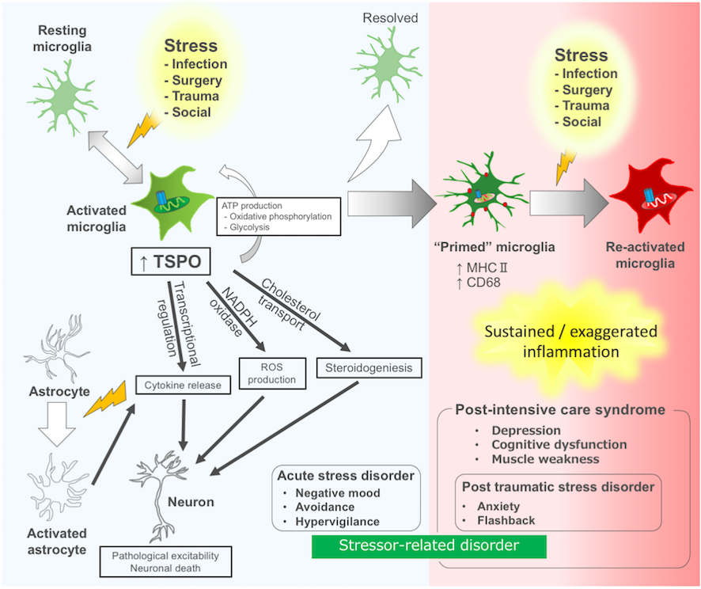

外傷や感染症など全身状態の悪化はしばしば集中治療が必要になります。全身管理のもと、たとえ全身状態が改善しても、集中治療室（ICU）からの生還者の中には、不安やうつ、筋力低下、集中力不足など精神・神経症状に悩まされることがあります。集中治療後症候群（post intensive care syndrome：PICS）として知られるこれらの病態は、昨今の新型コロナウイルス感染症の広がりを背景に関心を集めています。

これらの精神・神経症状の基盤には脳の炎症反応が関与することが知られており、中でもミクログリアやアストロサイトと呼ぼれるグリア細胞が中心的な役割を果たしています。上記の問題に取り組むため、私達は活性化したグリア細胞で多く発現するTSPO (Translocator protein 18 kDa)に注目して研究を進めています。

実際、実験的に活性化させた培養ミクログリア細胞ではTSPO遺伝子が平時よりも多く発現しており、逆にTSPO分子の機能を抑制したところ炎症反応を増悪させるサイトカインなどの液性因子の産生を抑えることを見出しました。

Nozaki K, Ito H, Ohgidani M, et al. Antidepressant effect of the translocator protein antagonist ONO-2952 on mouse behaviors under chronic social defeat stress. Neuropharmacology. 2020;162:107835. [[Link]](doi:10.1016/j.neuropharm.2019.107835)

また、小野薬品工業と共同して研究を進め、ONO-2952という化合物をマウスへ全身投与すると、社会的ストレスに対する脳の炎症反応を抑えるとともに、うつ病のような行動異常を予防する効果があることを見出しました。

[広島大学プレスリリース：脳の炎症に作用する TSPO を標的とした新たな抗うつ薬候補を発見](https://www.hiroshima-u.ac.jp/system/files/129948/%E3%83%97%E3%83%AC%E3%82%B9%E3%83%AA%E3%83%AA%E3%83%BC%E3%82%B9%EF%BC%88%E8%84%B3%E3%81%AE%E7%82%8E%E7%97%87%E3%81%AB%E4%BD%9C%E7%94%A8%E3%81%99%E3%82%8BTSPO%E3%82%92%E6%A8%99%E7%9A%84%E3%81%A8%E3%81%97%E3%81%9F%E6%96%B0%E3%81%9F%E3%81%AA%E6%8A%97%E3%81%86%E3%81%A4%E8%96%AC%E5%80%99%E8%A3%9C%E3%82%92%E7%99%BA%E8%A6%8B%EF%BC%89.pdf)

TSPOの働きを調べるポジトロン断層法(PET)という方法はすでにヒトを対象とした臨床研究が盛んでアルツハイマー認知症などの脳疾患の診断・治療研究に応用されつつあります。私達は、敗血症などの集中治療を要する疾患の新たな診断・治療法開発へむけてTSPOの役割やTSPO標的薬の研究をまとめ論文発表しました。これらを基盤として、集中治療後症候群や敗血症関連脳症の病態を明らかにします。

__ミクログリアTSPOとストレス関連障害__

Kikutani K, Giga H, Hosokawa K, Shime N, Aizawa H, __Microglial translocator protein and stressor-related disorder.__ Neurochem Int. 2020, _in press_ [[Link]](https://doi.org/10.1016/j.neuint.2020.104855)

