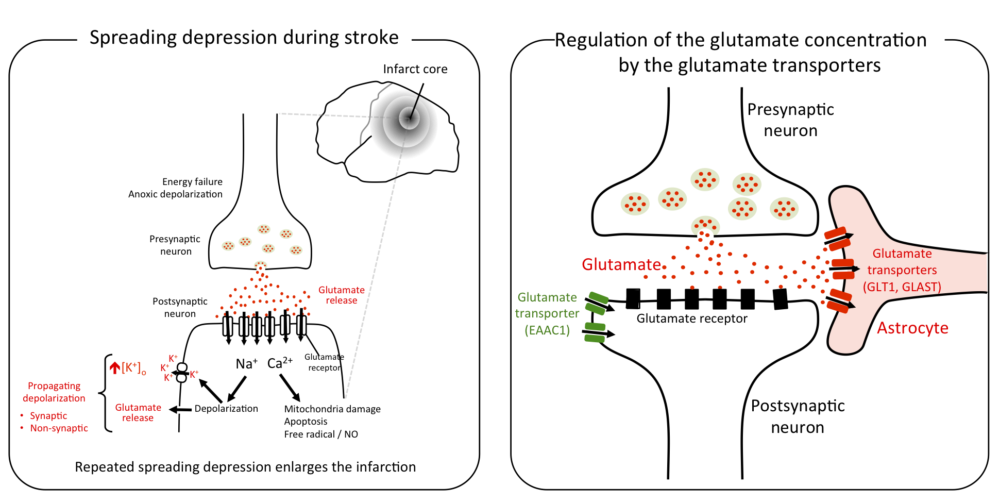

# 脳卒中や偏頭痛に共通した脳全体に拡大する神経興奮の波

脳の主な興奮性の神経連絡はグルタミン酸を介して行われています。しかし、シナプスなどの細胞外のグルタミン酸濃度が過剰になるとむしろ細胞に対して毒性を発揮します。このような過剰な興奮は波状に伝搬し、「Killer wave」などと呼ばれ片頭痛や脳梗塞を増悪させる要因になることがわかってきました。

[広島大学プレスリリース：片頭痛の前兆に関与する遺伝子をマウスで発見～片頭痛の病態解明や新たな治療薬の開発に前進～](https://neurobio.hiroshima-u.ac.jp/en/post/20200626/)

特に、虚血や低血糖などのストレス下では大脳皮質の興奮性はむしろ高まり、場合によってはその興奮の高まりが波のように三次元的に広がっていく拡延性抑制（もしくは拡延性脱分極）という現象が急激に注目を集めています。

実際、最近の多くのヒト機能画像研究が片頭痛や脳卒中・脳外傷の患者の大脳皮質で拡延性抑制を観察したと報告しています。さらに悪い事に拡延性抑制は繰り返し引き起こされ、例えば脳外傷では拡延性抑制が繰り返されるほど予後が不良になる傾向があるようです。

これは、おそらく拡延性抑制により大脳皮質細胞が必要とするエネルギー需要と虚血や低血糖などにより減少したエネルギー供給のミスマッチにより細胞死を起こす領域が拡大するためと考えられます。このような状況を改善するためには、拡延性抑制を抑える新たな治療法の確立が急務です。

この問題に挑戦するため、マウスやゼブラフィッシュをモデルとして研究を進めています。

**＜研究成果１＞**　グリア細胞の一種アストロサイトが拡延性抑制への感受性を制御していることを明らかにしました。通常、アストロサイトは細胞外のグルタミン酸を細胞内へ輸送体を使って運び込むことにより細胞外グルタミン酸濃度を低濃度に抑えています。我々が最近開発したグルタミン酸輸送体GLT-1のノックアウトマウスは大脳皮質の興奮性が病的に高まり、拡延性抑制に対する感受性が低くなっていました。グリア細胞のグルタミン酸輸送能を高める治療法を開発する事で拡延性抑制の頻度を抑え、ひいては頭痛の予防や脳卒中の予後改善につながる可能性を示唆しています。

**＜研究成果２＞**　薬剤スクリーニングに適したモデル動物ゼブラフィッシュの脳で拡延性抑制を再現することに成功しました。このことで、神経活動を指標として拡延性抑制を抑える候補薬を調べていきます。